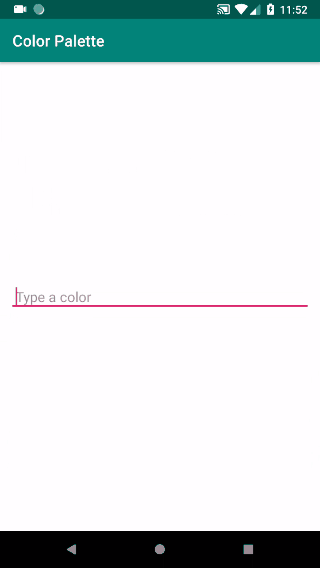

# AutoHintTextView - This library is currently in early development stage, and is unavailable at the moment.

This library allows you to set custom suggestions for hint auto-complete!



## How to
#### ~Gradle~
```Gradle
dependencies {
    implementation 'com.creativesource:autohinttextview:1.1.1'
}
```

### In your XML layout
```Xml
<com.creativesource.autohinttextview.AutoHintTextView
    android:id="@+id/tv_auto_hint"
    android:layout_width="wrap_content"
    android:layout_height="wrap_content"
    app:caseSensitive="true"
    app:setSuggestions="@array/my_array_of_suggestions"
    />
```

#### Custom Attributes
| Attribute | Description |
| --- | --- |
| `caseSensitive` | Whether or not text case is a suggestion factor |
| `setSuggestions` | Location of suggestion resource array |

### In your Java code
```Java
    autoHintTextView = (AutoHintTextView) findViewById(R.id.tv_auto_hint);
    ArrayList<String> suggestions = new ArrayList<>();
    suggestions.add("Lions");
    suggestions.add("Tigers");
    suggestions.add("Bears");
    autoHintTextView.setSuggestions(suggestions);
```

#### Custom Methods
| Method | Description |
| --- | --- |
| `setSuggestions(ArrayList<String> suggestions)`<br/>`setSuggestions(int resId)` | Sets custom hint suggestions |
| `setCaseSensitive(Boolean boolean)` | Whether or not text case is a suggestion factor |
| `addHintChangedListener(TextWatcher textWatcher)` | Listens to changes to suggestion hint |
| `addTextChangedListener(TextWatcher textWatcher)` | Listens to changes to entry text |

## License
    Copyright 2019 Jantz Carney
    
    Licensed under the Apache License, Version 2.0 (the "License");
    you may not use this file except in compliance with the License.
    You may obtain a copy of the License at
    
        http://www.apache.org/licenses/LICENSE-2.0
    
    Unless required by applicable law or agreed to in writing, software
    distributed under the License is distributed on an "AS IS" BASIS,
    WITHOUT WARRANTIES OR CONDITIONS OF ANY KIND, either express or implied.
    See the License for the specific language governing permissions and
    limitations under the License.
